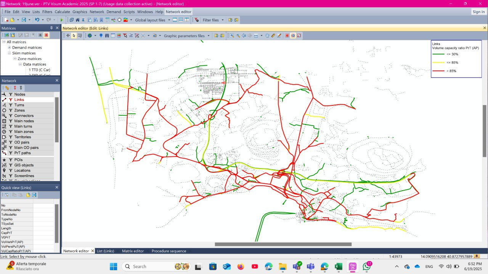

# 🗺️ Strategic Transport Planning & Demand Forecasting
### Project: Urban Network Modeling of Pozzuoli, Italy (Using PTV VISUM)

This project represents a sophisticated approach to **Urban Mobility Analytics**. By synthesizing large-scale demographic data (ISTAT 2011) with complex network supply, I architected a comprehensive transport model that predicts zonal interactions and traffic assignment for the Pozzuoli metropolitan area.

## 📺 Network Overview & Zoning
The model covers the complex urban structure of Pozzuoli, utilizing detailed traffic analysis zones (TAZ) to simulate origin-destination flows and inter-zonal connectivity.

  

## 🎯 Key Modeling Steps (Four-Step Model)
* **Trip Generation:** Estimated trip production and attraction based on population density and socio-economic indicators (`usefullpopulationdata.csv`).
* **Trip Distribution:** Developed Gravity Models and multi-modal Origin-Destination (OD) matrices for **Work**, **School**, and **Leisure** purposes.
* **Network Digitization:** Accurate representation of the Pozzuoli road infrastructure within the PTV VISUM environment.
* **Traffic Assignment:** Assigning demand matrices to the network to identify bottlenecks and analyze travel time costs.

## 📊 Technical Data & Assets
* **OD Matrices:** Specialized matrices for various travel motives (`ODmatrixtotalworker.csv`, `ODmatrixschoolworker.csv`).
* **Distance Matrices:** Precise impedance calculation between the 243 SEZ (Censimento) zones.
* **VISUM Network:** The core digital twin file (`19june - Copy.ver`) containing all structural and demand data.

## 📂 Project Structure
* `media/`: Visualization assets including the network zoning map.
* `19june - Copy.ver`: The primary PTV VISUM project file.
* `*.csv`: Comprehensive datasets for trip generation, distribution, and OD matrices.

---
*Note: This project serves as a high-level technical case study in Transportation Engineering and Macroscopic Simulation.*
